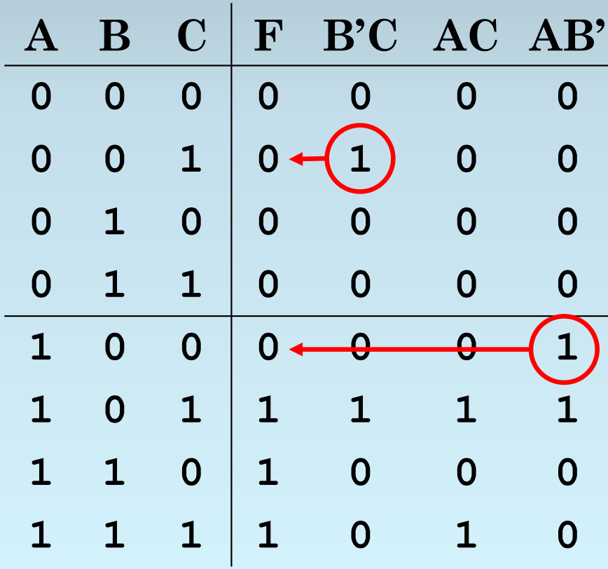
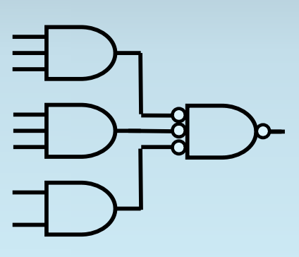
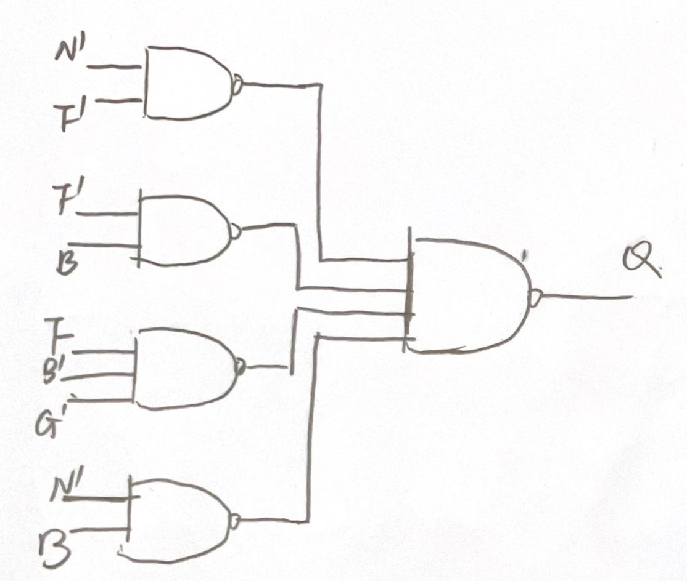

# 布尔逻辑(Boolean Logic)

布尔逻辑表达式将复杂的逻辑关系简化为基本的逻辑，并通过基本逻辑的运算来构建所需的逻辑表达式。这些表达式是数字电路设计的基础。

## 三种基本逻辑和Logic Completeness

对于三种最基本的逻辑NOT AND OR，需要掌握它们对应的真值表，书写形式（一般用A' AB A+B），以及图形表示

NOT AND OR合在一起，三者具有逻辑完备性，即它们可以表达世界上任何一种复杂的逻辑。这是为什么呢？

再复杂的逻辑都可以列出真值表（把逻辑表达式理解成一种函数，函数有多种表达形式，如解析式，表格式，图像式，逻辑表达式的字母形式就是一种解析式，而真值表就是一种表格式，它们表达的内容没区别，只是形式不同）列出真值表后，为了写出逻辑表达式，我们针对output是1的行，看input，如果input是1，那么就写这个input对应的字母，如果input是0，就写NOT input对应的字母，然后把所有input用AND组合起来。e.g inputABCD=1001的时候 output是1，那么就写AB'C'D 然后把每个output是1的行都这样写出来，再用OR连接，就是最终的逻辑表达式 e.g inputABCD = 0001的时候 output也是1 那么最后的function F = AB'C'D + A'B'C'D，用这样的方式，所有真值表都能转化成逻辑表达式。因此NOT AND OR具有逻辑完备性

逻辑完备性是非常重要的概念，逻辑表达式可能的情况非常多，不可能为每种情况创造一个逻辑关系，而希望用有限的逻辑关系表达无限的情况。

实际上有N个输入的情况，可能的逻辑表达式有$2^{2^N}$之多 如何理解$2^{2^N}$？1.N个input总共有$2^N$种可能的pattern，因为每个input可以选择是0还是1 e.g ABCD -> 2 * 2 * 2 * 2 = $2^4$ （真值表总共有$2^N$行） 2.对于每个固定的pattern的输入 e.g ABCD = 1001 output可能的情况有2种（0/1），即真值表的每行有两种情况，所以总的情况有 2 * 2 * 2 * ...（乘$2^N$次，因为有$2^N$行） = $2^{2^N}$

知道了NOT AND OR逻辑完备性之后，我们如果能证明一个底层架构可以表示NOT AND OR三种逻辑，就相当于证明了它有逻辑完备性，可以表示世界上所有的逻辑关系

e.g1:下证NOR的logic completeness（即NOR一个逻辑，可以表达所有的逻辑表达式）

NOR：全0出1，有1出0 （即OR逻辑前面再加了个NOT）

- NOT A = A NOR A -> A如果是0，那么全0出1，A如果是1，那么有1出0，正好符合NOT逻辑
- A OR B = NOT(A NOR B) = (A NOR B) NOR (A NOR B) -> 负负得正，即然NOR是OR前面加个NOT，那么OR就是NOR前面再加个NOT，已知NOT可以用 A NOR A来实现
- A AND B = (NOT A) NOR (NOT B) = (A NOR A) NOR (B NOR B) -> NOR 是全0出1，AND是全1出1，所以把输入反一下就好了，相当于在每个输入前加个NOT

e.g1:下证NAND的logic completeness（即NAND一个逻辑，可以表达所有的逻辑表达式）

NAND：全1出0，有0出1 （即AND逻辑前面再加了个NOT）

- NOT A = A NAND A -> A如果是0，那么有0出1，A如果是1，那么全1出0，正好符合NOT逻辑
- A AND B = NOT (A NAND B) = (A NAND B) NAND (A NAND B) ->负负得正，即然NAND是AND前面加个NOT，那么AND就是NAND前面再加个NOT，已知NOT可以用 A NAND A来实现
- A OR B = (NOT A) NAND (NOT B) = (A NAND A) NAND (B NAND B) -> NAND 是有0出1，OR是有1出1，所以把输入反一下就好了，相当于在每个输入前加个NOT

  

## 2's Complement Overflow的逻辑表达式

{: style="float: left; width: 45%;" }
{: style="float: right; width: 45%;" }

V = ABS' +  A'B'S 
ABS'是1的情况就是ABS = 110，即两个负数相加得到正数，overflow；A'B'S是1的情况就是ABS = 001,即两个正数相加得到负数，overflow（参考[2's complement](./Chapter1.md#unsign-representation)）

V = $C_{n} \oplus C_{n-1}$ 
最高位和次高位如果有且仅有一个进位，就是overflow，从概念的角度理解：

- 一正一负不会overflow -> 假设$C_{n-1}$ = 1,因为一正一负A和B有且仅有一个是1，1 + 1 = 10，进位，所以$C_{n}$也是1， XOR之后为0；假设$C_{n-1}$ = 0，因为一正一负A和B有且仅有一个是1，1 + 0 = 1，不进位，所以$C_{n}$也是1， XOR之后为0
- 两负得正数overflow -> 假设$C_{n-1}$ = 1，因为两个负数AB全部是1，1 + 1 + 1 = 11，进位，$C_{n}$ = 1，留下在最高位的数仍然是1（11去掉前面的1，剩下的还是1），结果仍然是负数，不overflow，XOR之后也是0；假设$C_{n-1}$ = 0，因为两个负数AB全部是1，1 + 1 + 0 = 10，进位，$C_{n}$ = 1，留在最高位的数是0，结果是正数，两个负数相加得正数，overflow，1 XOR 0 = 1
- 两正得负数overflow -> 假设$C_{n-1}$ = 1，因为两个正数AB全部是0，0 + 0 + 1 = 1，不进位，$C_{n}$ = 0，留下在最高位的数是1，结果变成负数，overflow，0 XOR 1之后是1；假设$C_{n-1}$ = 0，因为两个正数AB全部是0，0 + 0 + 0 = 0，不进位，$C_{n}$ = 0，留在最高位的数是0，结果是正数，不overflow，XOR的结果也是0

严谨的证明：画真值表，把每种情况列出来，最后发现$C_{n} \oplus C_{n-1}$ 运算的结果和V = ABS' +  A'B'S 一样，即证明这两个表达式完全等价。（ECE120的考试，证明逻辑表达式的等价，不用多想去用boolean运算法则，直接画真值表就行）

## Optimize Logic Expression(K-map)

  ⚠️very important

 

一些术语：

- Minterm/Maxterm：代表了真值表的一行，所有输入必须出现（以其本身或其complement的形式）且只能出现一次，minterm输入之间是AND关系，maxterm输入之间是OR关系
- SOP：内层是AND，外层是OR的逻辑表达式 e.g ABC + A'B'
- POS：内层是OR，外层是AND的逻辑表达式 e.g (A + B')(A' + B + C)
- Canonical form：由midterm组成的的SOP，或是由maxterm组成的POS。canonical是标准表达式，对于同一个真值表有很多表达式（各种变形化简），难以判断不同的表达式是否表达相同的逻辑。canonical的表达式就是直接用真值表（看着哪行是1写sop 看着哪行是0写pos的最原始表达式）这样的表达式对于一个确定的真值表是唯一的，方便比较
- implication 逻辑关系：implication为True当且仅当条件为真的时候结论也为真，条件为假时结论的真假无所谓

虽然canonical form的逻辑表达式对于特定的真值表是唯一确定的，但是它往往比较复杂，不符合设计电路的要求（参见[判断逻辑表达式优劣](./Chapter4.md#heuristics-methods)）实际情况下需要我们化简变形逻辑表达式

化简逻辑表达式有两种方法，第一种是比较麻烦的implicant分析法（考试不会考，只需要了解概念），第二种是非常非常非常重要的考点K-map化简法

implicant分析法：对于F = AB'C + ABC' + ABC 我们知道AB'C是F的一个implicant（当AB'C为1时F一定为1，当AB'C为0时F不知道/无所谓），但是AB'C不一定是F的prime implicant（最简implicant），就是说，也许此处还可以化简掉一些字。implicant分析法就是列真值表，看AB' AC B'C里面有没有是F的implicant的，如果有，就说明原来的AB'C还可以化简，用新的implicant代替原来的。依次分析AB'C ABC' ABC这三个implicant，化简，再分析，在化简（如果可以的话），直到得到所有的项都是prime implicant，不能再化简了为止

{: width="300" height="auto"}

原理：

- AC作为一个implicant只包含函数F的部分信息，所有的信息取决于各个implicant
- AC包括的信息（出1的情况）一定比AB'C多，所以不用担心替换后信息会缺失
- 如果以个式子不是implicant，即存在表达式为1时F为0，说明这个式子和F的输出没有直接关系，因此它也不可能出现在F化简后的表达式中

### K-maps

grey code: 

k-maps绘制表格的时候 00 01 11 10的排序和我们通常按照从小到大书写二进制数字 00 01 10 11的顺序不同，因为k-maps采用了格雷码编写，这种编码的特点是相邻两个数之间只相差一位，首位循环（即头00和尾10也满足相差一位的特点）这种编码构成了k-maps可以用来化简逻辑表达式的数学原理，因为相邻的方格只有一个位置是不同的，如果这两个方格可以被圈到同一个圈中，那么说明不同的位置的那个literal是没有用的，可以被化简的，比如，10代表AB'和11代表AB被圈在了一起，AB' + AB = A，这个不一样的literal B是没有用的，因为它1/0对F的输出不起作用（输出都为1或者是0）。grey code的编码方式也决定了k-maps圈的时候一定是矩形，因为非矩形不能体现相邻两个方格输出相同，可以化简一个literal的性质

注意：考试的时候，画表格别写错10 和 11的顺序，把真值表的内容填写到k-maps的时候也要特别小心顺序的对换（一般真值表都是以00 01 10 11从小到大的顺序书写的）

一点个人小小的脑洞（与考试无关）：可不可以写出N位的grey code呢？1位的grey code 0 1， 2位的grey code 00 01 11 10，3位的grey code ？其实grey code的书写是一种控制变量的过程，再加上一点小小的镜像可以写出任意位的grey code。比如我想写3位，都从000开始，我先控制第一位第二位都不变 000 -> 001， 然后需要改变一位，按照从低到高的顺序，改变第二位，001 -> 011，然后 011 -> 010，注意到其实就是在2位的grey code前面加上了一个0。然后我不得不改变第一位了（最高位）010 -> 110 然后怎么写呢？最高位现在被固定为1了，后面两位的变化顺序是模仿2位grey code 00 -> 01 -> 11 -> 10，我希望满足grey code的性质，即相邻两串二进制之间只差一位，那么很简答，既然我原来是00 -> 01 -> 11 -> 10这个顺序写过来的，我现在就是10 -> 11 -> 01 -> 00倒着写回去（镜像），得到3位的grey code为000 001 011 010 110 111 101 100正好首尾循环。同样，如果想写4位的grey code，前八位，我控制变量最高位位0，在3位grey code前添0，得到0000 0001 0011 0010 0110 0111 0101 0100，后八位，控制最高位为1，后三位倒着写回去 1100 1101 1111 1110 1010 1011 1001 1000，同样的方法可以被应用到N位

K-map是大概有三种类型的题目，1.求SOP表达式 2.求POS表达式 3.化简含有don't care（X）的逻辑表达式

#### SOP

SOP的形式在真值表上对应的是输出为1的一排。看输出为1的行，如果输入literal为0，对应输出1，那么该literal取非（NOT），所有的literal用AND连接，比如真值表的第三行，写做F'N'BG'，最后把这些minterm全部加起来就是F的canonical form

接着求最简表达式，把这个真值表填写到k-map里面，在填写的时候注意顺序（11在10前面！）

    

        <table style="border-collapse: collapse; width: 500px;">
            <thead>
                <tr>
                    <th style="border: 1px solid black;">F</th>
                    <th style="border: 1px solid black;">N</th>
                    <th style="border: 1px solid black;">B</th>
                    <th style="border: 1px solid black;">G</th>
                    <th style="border: 1px solid black;">Q</th>
                </tr>
            </thead>
            <tbody>
                <tr>
                    <td style="border: 1px solid black;">0</td>
                    <td style="border: 1px solid black;">0</td>
                    <td style="border: 1px solid black;">0</td>
                    <td style="border: 1px solid black;">0</td>
                    <td style="border: 1px solid black;">1</td>
                </tr>
                <tr>
                    <td style="border: 1px solid black;">0</td>
                    <td style="border: 1px solid black;">0</td>
                    <td style="border: 1px solid black;">0</td>
                    <td style="border: 1px solid black;">1</td>
                    <td style="border: 1px solid black;">1</td>
                </tr>
                <tr>
                    <td style="border: 1px solid black;">0</td>
                    <td style="border: 1px solid black;">0</td>
                    <td style="border: 1px solid black;">1</td>
                    <td style="border: 1px solid black;">0</td>
                    <td style="border: 1px solid black;">1</td>
                </tr>
                <tr>
                    <td style="border: 1px solid black;">0</td>
                    <td style="border: 1px solid black;">0</td>
                    <td style="border: 1px solid black;">1</td>
                    <td style="border: 1px solid black;">1</td>
                    <td style="border: 1px solid black;">1</td>
                </tr>
                <tr>
                    <td style="border: 1px solid black;">0</td>
                    <td style="border: 1px solid black;">1</td>
                    <td style="border: 1px solid black;">0</td>
                    <td style="border: 1px solid black;">0</td>
                    <td style="border: 1px solid black;">0</td>
                </tr>
                <tr>
                    <td style="border: 1px solid black;">0</td>
                    <td style="border: 1px solid black;">1</td>
                    <td style="border: 1px solid black;">0</td>
                    <td style="border: 1px solid black;">1</td>
                    <td style="border: 1px solid black;">0</td>
                </tr>
                <tr>
                    <td style="border: 1px solid black;">0</td>
                    <td style="border: 1px solid black;">1</td>
                    <td style="border: 1px solid black;">1</td>
                    <td style="border: 1px solid black;">0</td>
                    <td style="border: 1px solid black;">1</td>
                </tr>
                <tr>
                    <td style="border: 1px solid black;">0</td>
                    <td style="border: 1px solid black;">1</td>
                    <td style="border: 1px solid black;">1</td>
                    <td style="border: 1px solid black;">1</td>
                    <td style="border: 1px solid black;">1</td>
                </tr>
                <tr>
                    <td style="border: 1px solid black;">1</td>
                    <td style="border: 1px solid black;">0</td>
                    <td style="border: 1px solid black;">0</td>
                    <td style="border: 1px solid black;">0</td>
                    <td style="border: 1px solid black;">1</td>
                </tr>
                <tr>
                    <td style="border: 1px solid black;">1</td>
                    <td style="border: 1px solid black;">0</td>
                    <td style="border: 1px solid black;">0</td>
                    <td style="border: 1px solid black;">1</td>
                    <td style="border: 1px solid black;">0</td>
                </tr>
                <tr>
                    <td style="border: 1px solid black;">1</td>
                    <td style="border: 1px solid black;">0</td>
                    <td style="border: 1px solid black;">1</td>
                    <td style="border: 1px solid black;">0</td>
                    <td style="border: 1px solid black;">1</td>
                </tr>
                <tr>
                    <td style="border: 1px solid black;">1</td>
                    <td style="border: 1px solid black;">0</td>
                    <td style="border: 1px solid black;">1</td>
                    <td style="border: 1px solid black;">1</td>
                    <td style="border: 1px solid black;">1</td>
                </tr>
                <tr>
                    <td style="border: 1px solid black;">1</td>
                    <td style="border: 1px solid black;">1</td>
                    <td style="border: 1px solid black;">0</td>
                    <td style="border: 1px solid black;">0</td>
                    <td style="border: 1px solid black;">1</td>
                </tr>
                <tr>
                    <td style="border: 1px solid black;">1</td>
                    <td style="border: 1px solid black;">1</td>
                    <td style="border: 1px solid black;">0</td>
                    <td style="border: 1px solid black;">1</td>
                    <td style="border: 1px solid black;">0</td>
                </tr>
                <tr>
                    <td style="border: 1px solid black;">1</td>
                    <td style="border: 1px solid black;">1</td>
                    <td style="border: 1px solid black;">1</td>
                    <td style="border: 1px solid black;">0</td>
                    <td style="border: 1px solid black;">0</td>
                </tr>
                <tr>
                    <td style="border: 1px solid black;">1</td>
                    <td style="border: 1px solid black;">1</td>
                    <td style="border: 1px solid black;">1</td>
                    <td style="border: 1px solid black;">1</td>
                    <td style="border: 1px solid black;">0</td>
                </tr>
            </tbody>
        </table>
    

{: style="float: left; width: 600px;" }

然后开始圈k-maps，原则为1.所有的1都要被包括在某个圈中 2.圈要尽可能的大 3.圈的总数要尽可能小 满足这三条要求之后，就可以得到化简结果。我个人会喜欢先检查四个角，因为grey code具有循环性，所以上下左右边界的圈很容易全错（易圈小）。可以看到这个k-map四个角上都有1，可以组成一个大圈，先圈起来。然后在检查边缘的1，1100位置对应的1，看上下左右，上右为0，左边（即1110这个格子）也为0，下方为1，所以只能向下圈。

{: style="float: left; width: 45%;" }
{: style="float: right; width: 45%;" }

然后看0110这个边缘的1，可以与左边和上面的1组成一个圈。在看1011这个1，可以向下方延伸，4个1组成一个圈。

{: style="float: left; width: 45%;" }
{: style="float: right; width: 45%;" }

还有一个落单的1（0001），横排组成一个圈。最后检查是否有重复的圈，发现对角线四个1都已经被包含到其他圈里面了，所以可以去掉这个圈。

{: style="float: left; width: 45%;" }
{: style="float: right; width: 45%;" }

圈好k-map之后，写出化简的表达式SOP

- 最上方横着的圈，对应左侧的00 -> N'F'
- 右侧的四个1，对应左侧00 01（不变的是0），上方的11 10（不变的是1） -> F'B
- 左下方的两个1，对应左侧11 10（不变的是1），上方00 -> FB'G'
- 右下方和右上方连在一起的圈，对应左侧10 00（不变的是0），上方的11 10（不变的是1） -> N'B
- Q = N'F' + F'B + FB'G' + N'B
  

最后检查有无重复的圈这步很重要，例如以下k-maps，依据圈尽可能大的原则，一上来的时候会圈中间的四个1，然后为了把边缘的四个1包含进去，又圈了4个小圈，最后发现中间的那个大圈被包含了，大圈需要被去除（虽然大圈对应的表达式会更加简单）

{: style="float: left; width: 45%;" }
{: style="float: right; width: 45%;" }

#### POS

POS的形式在真值表上对应的是输出为0的一排。看输出为0的行，如果输入literal为1，对应输出0，那么该literal取非（NOT），所有的literal用OR连接，比如真值表[查看真值表](#truth-table)的第六行，写做F + N' + B + G'，这么写的原理是OR的逻辑是全0才出0，所以是1的literal要非一下，然后已知FNBG = 0100 0101 1001 1101 1110 1111的时候输出Q都为0，逻辑为但凡满足一种情况，最后输出一定为0，这个是AND有0出0的逻辑，所以最后把这些maxterm全部product（AND）起来就是F的canonical form

{: style="float: left; width: 500px;" }

用k-maps化简POS过程完全与SOP一样，只不过圈的是0而不是1。圈完之后写表达式，橙色的圈，对应左侧01，上方00 01（不变的为0）F + N' + B;蓝色的圈，对应左侧11 10（不变的为1），上方01 F' + B + G';紫色的圈，对应左侧11，上方11 10（不变的为1）F' + N' + B'

Q = (F + N' + B)(F' + B + G')(F' + N' + B')

#### Don't Care

带有Don't Care(X)的题目是K-map中最难的一类，也是最容易错的。Don't care是用来表示1.一些不可能的input情况（因为input不会发生，所以output是什么都不重要） 2.一些不重要的input，对于这些input，我们不关注它的output是什么。 Don't Care是实际问题中容易碰到的情况。

有Don't care的k-maps的化简准则 1.所有的1必须被包括，但是x（don't care）可以被包括也可以不被包括 （对应实际问题中输出不重要，可1可0） 2.包括1的圈尽可能大 3.圈的数量尽可能小

{: style="float: left; width: 500px;" }

#### Tips
我个人解K-map问题的一些顺序：

- 先看四个角（边缘特别容易漏），如果四个角上都有1/0，先圈起来
- 再看边缘，以SOP举例，看1，对于一个边缘的1，需要上下左右全部看一遍，其中也许"上下"是循环的上下，比如左上角的1，它对应的上就是左下角的1；"左右"是循环的左右，最左侧边缘的左边是最右侧边缘
- 然后看中间（从最多的1开始检索，能不能圈8个1？能不能圈4个1？能不能圈2个1）
- 最后检查一下有没有重叠的圈，去除

其他说明：

- k-map化简的结果不唯一，比如对于一个map最少的圈数量为3，但是这3个圈的圈法可能不同
- SOP简单还是POS简单不能直接判断，需要都写出来观察（如果题目要求比较的话）

## POS SOP与电路

根据[MOSFET的性质](./Chapter4.md#mosfet晶体管)，CMOS电路比较容易搭建的逻辑门是NAND和NOR，根据[logic-completeness](./Chapter2.md#三种基本逻辑和logic-completeness)，NAND或NOR单独都可以表示任何一种逻辑表达式。所以我们希望把pos sop化成相应的NAND/NOR表示，方便搭建电路

化简表达式的基本法则是De Morgan's Laws：1.A'B' = (A + B)' 2.(AB)' = A' + B'

{: style="float: left; width: 700px;" }

### SOP -> 2 level NAND

SOP可以转化成两层的NAND（假设A和A’都可以直接得到），使用的公式为 A'B' = (A + B)' -> A + B = (A'B')' e.g 根据前面例子里得到的 Q = N'F' + F'B + FB'G' + N'B -> Q = ((N'F')'(F'B)'(FB'G')'(N'B)')'

{: style="float: left; width: 45%;" }
{: style="float: right; width: 45%;" }

{: style="float: left; width: 600px;" }

### POS -> 2 level NOR

POS可以转化成两层的NOR（假设A和A’都可以直接得到），使用的公式为 (AB)' = A' + B' -> AB = (A'+ B')' e.g 根据前面例子里得到的 Q = (F + N' + B)(F' + B + G')(F' + N' + B') -> Q = ((F + N' + B)' + (F' + B + G')' + (F' + N' + B')')'

{: style="float: left; width: 45%;" }
{: style="float: right; width: 45%;" }

{: style="float: left; width: 600px;" }

## 逻辑表达式的对偶性（Duality）

