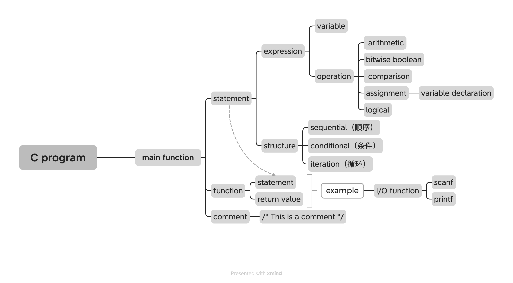

# C语言(C Programming Language)

120涉及到一点基本的C语言语法介绍，为220的programming做准备。考试对于C的要求不是很高，一般是给出一个程序，判断它的作用。



## Main Function

所有的C语言程序都有一个main函数，作为程序的入口点。[220知识]当一个C程序被编译并链接成可执行文件后，操作系统在加载并执行这个程序时：

- 可执行文件加载到内存
- 初始化栈堆，全局变量
- 调用main函数，执行程序

main函数的基本结构如下：

```c
int main() {
    // 代码
    return 0;
}
```
- 其中'int'表示函数返回值的数据类型是整数型
- 'main'是函数的名称（main函数作为程序的入口，其名称是固定的，而其他自定义的函数，名称可以自拟）
- '()'是用来传递参数的，此处括号为空，表示没有传递给main函数的参数
- return 0 函数的返回值，0表示程序成功执行，没有错误，非0的值表示程序执行出现异常，对main函数来说，返回值是返回给操作系统的，main函数的return语句也标志着程序的结束

C语言函数的具体性质见[Function](./Chapter3.md/#Function)

## Variable

variable（变量）实际上是人类给存储在计算机内存中的二进制位（bits）取的名字，方便编写程序。每个变量都有一个特定的类型，该类型决定了变量可以存储的数据类型和大小。

```c
int A = 42;
char B = 'H';
float C;
C = 3.1415
```

不同类型的数据有不同的表示方式（representation），但最终存储到计算机内存中时，都是一串二进制位（bits）。变量相当于给这串特定的二进制位取了对应的名字（220:变量名对应的是相应数据的存储地址）

以上是变量初始化的三个例子，通用的格式是`<data type> <identifier> = <value>;` `<data type>`确定变量的数据类型，int？float？char？`<identifier>`是变量的名字，自定义，区分大小写，只能由数字，字母，下划线组成 & 开头只能是字母 & 不能使用关键字（即在C语言中有特殊含义的字，如if/char）`<value>`是初始化的值，决定了这个变量对应的内存空间里存储了什么样的bits pattern。

变量可以先不初始化，`<data type> <identifier>;` 例如变量C，我先申明有这个变量，并且根据它的data type（float）为C分配内存（IEEE 754 -> 32 bits），但是此时这些bits没有含义（可以理解是内存中的乱码）可能是0000 1011 1111 0000 0010这种，不一定是0，之后我再根据需要对C进行赋值

- 在初始化char类型的数据的时候，要注意用' '单引号，C中单引号表示字符，双引号表示字符串
- 变量在初始化之后可以更改值 e.g `A = 5;`把A的值从42改成了5
- C语言的primitive datatype的representation具体用多少个bits是不一定的，不同系统结果不同，e.g 有的系统int是16 bits 2's complement，有的系统int是32 bits 2's complement

## Operation
operation是用来对数据进行处理（运算）的，运算大致分为arithmetic（代数运算），bitwise boolean（逐位布尔逻辑运算），comparison（比较运算），assignment（赋值运算），logical（逻辑运算）

### Arithmetic
加减乘除取余数`+ - * / %`

C语言中的`/`是整除（直接truncated，舍弃小数位，只要整数位） e.g 100 / 3 = 33 （`/`这个operation不能改变数据类型，100和3都是整型，最后结果也要是整数型）

C语言中的`%`的余数可能是负数

- 运算公式：$A \% B = A - (A / B) * B$ 先算出A整除B的值，然后再用A减去前面算出来的值乘B
- -42 % 5 ：1. -42 / 5 = -8 （准确值是-8.4，直接truncated，取-8；如果是向下取整，此处应该为-9）2. -42 - (-8 * 5) =  -42 + 40 = -2


### Bitwise Boolean

| 运算符 | 名称       | 描述               |
|--------|------------|--------------------|
| `&`    | AND        | 按位与（AND）      |
| `|`    | OR         | 按位或（OR）       |
| `~`    | NOT        | 按位取反（NOT）    |
| `^`    | XOR        | 按位异或（XOR）    |
| `<<`   | 左移       | 左移（left shift） |
| `>>`   | 右移       | 右移（right shift）|

- “按位运算”，$(a_3a_2a_1a_0)_2$ | $(b_3b_2b_1b_0)_2$ 是 $a_3$ | $b_3$ $a_2$ | $b_2$对应的位进行运算
- 使用前四种bitwise boolean operations的时候对应的数据类型一般是unsigned int
- 使用`>>`的时候要注意数据类型，如果是unsigned int就右移n位之后在最高位添n个0；如果是int（用2's completement表示）就右移n位之后在最高位添n个sign bit（原来是负数1就添1，原来是正数0就添0）
- A << n 相当于$A \times 2^n$但可能出现overflow的情况；A >> n相当于$A \div 2^n$（向下取整）

### Rational/Comparison

less than: `<` less or equal to: `<=` equal: `==` (两个等于，一个等于是assign operation) not equal: `!=` greater or equal to: `>=` greater than: `>`

- 这些operation运算完的结果是boolean值（True -> 1 False -> 0）
- 结果取决于数据类型，1000 和 0111比大小，unsigned int情况下1000 > 0111，int（对应2's complement表示）情况下1000 < 0111 
- 连接多个rational表达式 A > B and B > C用logical operation，参见[logical operation](#logical)

### Assignment

用于variable declaration（见[variable](#variable)）

- 等式的左边必须是一个variable
- 运算的顺序是先计算等式右边，得出要赋给variable的值，然后再把这个值赋值给等式左边的variable。这种运算顺序决定了A = A + 1是合法的

### Logical

AND `&&` OR `||` NOT `!`

bitwise boolean operations和logical operations的区别是前者作用于一长串的bits，运算结果是一串bits，后者作用于truth value，运算结果也是truth value。在C语言中，truth value 0代表False，其他所有非0数都代表True。truth value只用真或假两种情况。

e.g !120 && 1 = 0 如果120前加`!` ，120会被认为是一个truth value，因为它不是0，所以表示true，not之后为False(0)， False && True = False -> 0

AND `&&` OR `||` NOT `!`运算优先级顺序是“非与或”

## Statement

statement（语句）告诉电脑具体的指令/操作。statment有三种结构，sequential（顺序结构，按照statement的先后顺序一条条执行），conditional（条件选择结构，满足某种条件才执行某个statement），iteration（循环结构，在满足某种条件的情况下，某个statement被反复执行）

```c
//conditional
if ( <expression> ) {
    //如果expression的truth value为1，执行以下code
    //codes
} else {
    //如果expression的truth value为0，执行以下code
    //code
}
```

```c
//iteration
for (<init>; <test>; <update>) {
    /* loop body */
}

while (<test>) {
    /* loop body */
}
```
- 特别注意for循环中第一次先执行`<init>`然后会进行判断`<test>`在进入循环，所以假设判断是 a < 10， init是 a = 42，那么for循环就不会被执行
- while循环第一次也会先test，如果test是False，循环体也不会被执行

## Function

```c
<datatype> <function name>(<parameters>){
    //codes
    return <something>
}
```

main函数只不过是函数中特殊的一种，实际上c语言中有各种各样的函数，函数定义的基本结构都是相同的：1.函数返回值的数据类型 2.函数名称 3.函数接收的参数 4.{} 大括号，大括号里面是实现函数的statement 5.statement最后是return语句

- C语言中的Function就是一堆代码，最后返回一个值
- Function不一定是 algorithm，如下function一直输出"hello"，不符合algorithm有限性的特点

```c
int hello() {
    while (1) {  // 无限循环 1->True
        printf("hello");
    }
    return 1;
}
```
在c语言中，实现交互（输入输出）靠的就是`scanf`和`printf`这两个函数，如果想要使用这两个函数来实现input & output就需要在程序的开头加入`#include <stdio.h>`，这行指令的作用是把`stdio.h`这个头文件加入到我们程序的开头，这样我们就不需要自己编写`scanf`和`printf`这两个函数，而可以直接使用标准输入输出库中的函数。

`printf` 输出到显示器上：

- **转义字符 `\`**：反斜杠用于格式化一些特殊字符。例如，换行符 `\n`。如果想要输出反斜杠本身，需要使用两个反斜杠 `\\`，前一个表示这是一个特殊字符（类似于 `\n` 前的反斜杠），后一个表示这个特殊字符是反斜杠本身
- **格式化说明符**：格式化说明符用于将一串位按照某种编码方式转化为实际含义，并以字符串形式打印输出。例如，将 `1000` 转化为二进制补码下的 `-8`
  - 格式化说明符的数量必须与实际要转化的数据数量一致
  - 数据类型必须与要转化的变量的数据类型匹配。下面的程序示例是错误的，因为 `A` 的类型是 `char`，但使用的格式化说明符是 `%d`，它是用来转化整型变量的
- **函数返回值**：`printf`返回成功被转化并打印到显示器上的字符个数，返回值类型为整数型，返回值一般没有什么用

```c
char A = 'o';
printf("The answer is %d", A);
```

`scanf`从键盘读取数据：

```c
int A;
printf("Please enter an integer");
scanf("%d", &A);
```

- `&`获取变量的地址，scanf读取的输入最后要被存储到内存中，变量名（A）其实是给内存中的一块存储空间取了个名字， `&`用于通过名字，获取内存地址
- **格式化说明符**：要求同`printf`
- **函数返回值**：`scanf`返回成功被转化并存储到内存中字符的个数，返回值类型为整数型，返回值一般用于检验输入是否合法。如下程序，求输入数字的平方，通过scanf的返回值来判断输入是否合法。

```c
int main(){
    int A;
    printf("Please enter an integer");
    if (1 != scanf("%d", &A)){
        /* the input is invalid */
        /* e.g human type 'hhh' which is not an integer*/
        return 1; //an error occur
    }
    A = A * A；
    printf("The square of the integer is: %d", A);
    return 0;
}
```

## Code Example

```c
int main ()
{
    unsigned int A, B, C;
    printf ("Please enter two numbers: ");
    if (2 != scanf ("%u%u", &A, &B)) {
        printf ("Invalid input.\n");
        return 3;
    }
    for (C = 0; 0 != A; A = (A >> 1)) {
        if (1 == (A & 1)) {
            C = C + B;
        }
        B = (B << 1);
    }
    printf ("The answer is %u.\n", C);
    return 0;
}
```

这段代码计算了 A 和 B 两个数的乘积。为什么是这样呢？可以类比一下十进制的乘法 $(a_1a_0)_{10} \times (b_2b_1b_0)_{10}$。我们先计算 $a_0 \times (b_2b_1b_0)$ 得到一个值，然后再计算 $a_1 \times (b_2b_1b_0)$。由于 $a_1$ 是十位上的数，乘出来的结果需要乘以 10 才是正确的值。这个乘 10 的过程，我也可以对 $(b_2b_1b_0)$ 进行操作，相当于 $a_1 \times (b_2b_1b_00)$  --- 想象一下列竖式乘法

因此，在计算二进制的乘法时也是这样，把A的每一个位分别取出来，与B相乘，每次乘完，B就乘2（left shift）


## Notes

其他有可能考到的点：

- Test程序：full code coverage，意思是test至少要保证程序中的每个语句都执行过一遍，如在设计测试样例的时候，对于if else语句，就要构造两个样例，一个测试if，一个测试else （220有考过给一段C语言程序，判断至少要几个测试样例才能实现full code coverage）
- Floating Point Problem：当一个非常大的数和一个非常小的数相加的时候，结果可能不能被floating point representation表示，导致一些程序中的错误。参见[Floating Point Representation](./Chapter1.md#floating-point-representation)
- 写程序的时候别忘了在每个statement后面加`;` !!!