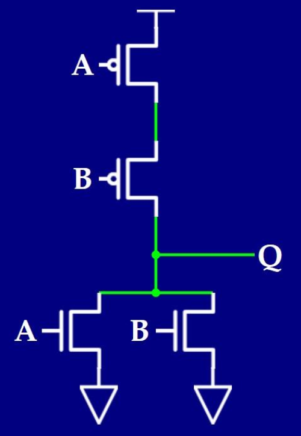
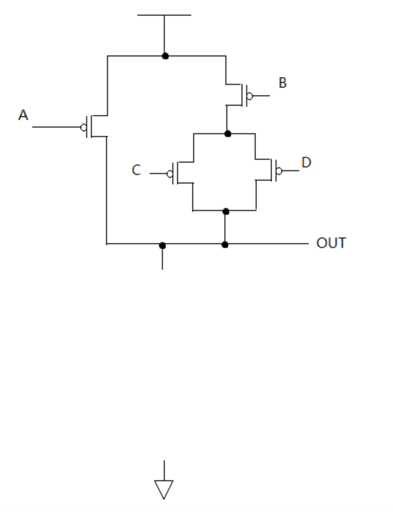
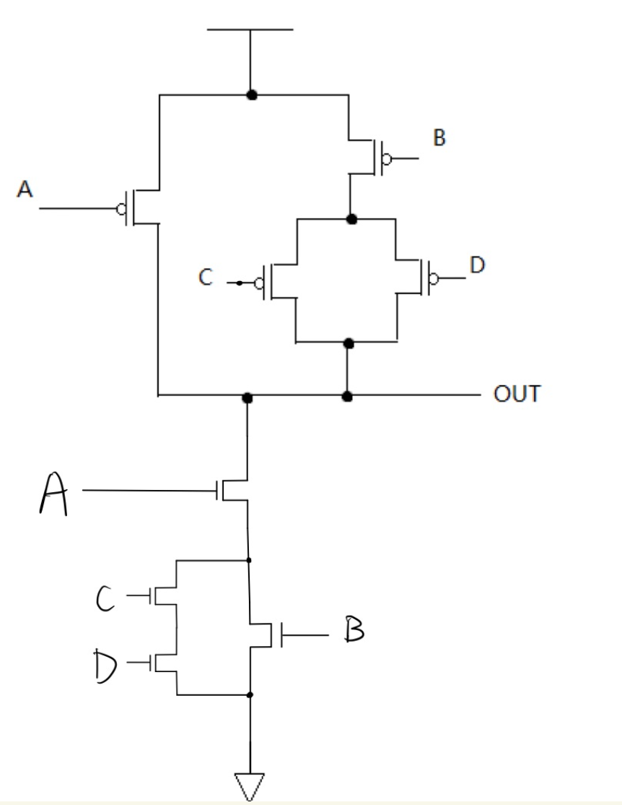
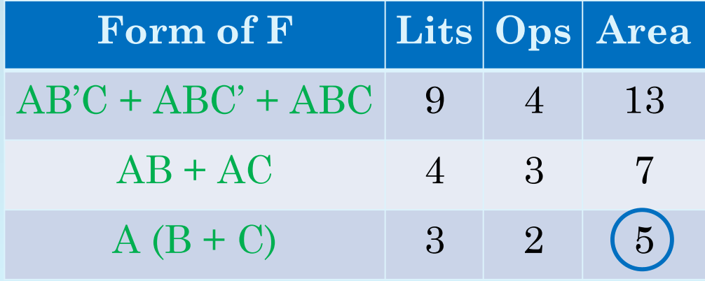

# Digital Device(电路元件)

## MOSFET(晶体管)

MOSFET分为两种n-type和p-type，对于120的来说，这两种MOSFET都可以简单的理解为开关

- n-type：当输入端为高电压（1）时开关闭合（接通）
- p-type：当输入端为低电压（0）时开关闭合（接通）
  
在构成逻辑门的时候，n-type和p-type MOSFET的数量一定是一样的，而且由于MOSFET的性质（Beyond 120）n-type总是靠近地，p-type总是靠近电源，不能对换顺序（所以如果想造一个AND门，不能简单的把NAND门中的n-type和p-type对掉，而需要在NAND门前面接一个NOT门）

考点：1.根据电路写出逻辑表达式 2.根据逻辑表达式画出电路图 3.根据电路对偶性补全电路

这三个考点都是指向相同的知识点：

- 1.MOSFET的串联对应的是逻辑表达式的AND（AB） -> 只有一起导通才算导通
- 2.MOSFET的并联对应的是逻辑表达式的OR（A+B） -> 只要一个导通就算导通
- 3.p-type对应的输入是A'（输入0导通），n-type输入对应的是A（输入1导通） 
- 4.p-type对应的输出是1（导通后接电源，输出为高电平1），n-type对应的输出是0（导通后接地，对应的输出是低电平0） - 5.MOSFET电路是对偶的，电路的上半部分/下半部分都可以完整的展示出逻辑表达式，通过De Morgan's Laws转化之后，两个表达式完全等价

是什么意思呢？以最简单的NOR门举例

{: width="300" height="auto"}

仅看电路上半部分，根据1串联法则+3输入法则，表达式应该写成 A'B'，根据4输出法则，最终的式子写成 Q = A'B'

仅看电路的下半部分，根据2并联法则+3输入法则，表达式应该写成 A + B，根据4输出法则，最终的式子写成 Q' = A + B，化成Q的表达式 Q = (A + B)'，可以清楚地看到这个门电路就是NOR

其实根据De Morgan's Laws：1.A'B' = (A + B)' 2.(AB)' = A' + B' 我们知道根据电路上半部分和下半部分写出来的表达式是完全等价的，这个就是电路的对偶性（AND变OR，OR变AND）

基于这个原则，来尝试一下各个考点的题目。

### 1.写逻辑表达式

根据如下电路图写出Q的表达式

{: width="250" height="auto"}

看一半。如果选择看电路的上半部分：根据12串并联法则+3输入法则，可以写出(A' + B')C'，根据4输出法则，得 Q = (A' + B')C'。如果选择看电路的下半部分：根据12串并联法则+3输入法则，可以写出 AB + C，根据4输出法则得 Q' = AB + C -> Q = (AB + C)'

验证两个表达式是否相同可以用De Morgan's Laws: Q = (AB + C)' = (AB)'C' = (A' + B')C'

### 2.画电路图
e.g implement function Q = ((A+B')C)'

先分析一下，最外面一层是'，符合输出法则中n-type的输出，即Q' = (A + B')C，所以从下半部分电路开始搭建比较方便。注意B需要非一下，所以让输入先过一个非门，形成B'。下半部分电路A与B'并联，再与C串联，搭建好之后如下：

{: width="250" height="auto"}

如何搭建上半部分电路，有两种方法。复杂一点的，根据De Morgan's Laws把前面Q'（Q' = (A + B')C）的表达式化成Q的表达式：Q = ((A+B')C)' -> Q = (A + B')' + C' -> = Q = A'B + C' 注意根据输入法则，p-type输入带非，所以A' C'相当于A C直接接p-type输入端口，而B，相当于B'接p-type输入端口，据此表达式可以补全电路。

方法二，根据电路的对偶性直接补全。下半部分串联到上半部分改并联，下半部分并联到上半部分改串联。

{: width="250" height="auto"}

### 3.补全电路图

{: width="300" height="auto"}

这种题目也是两种办法，第一个根据已经给出的电路写出逻辑表达式，从最内层（C D）开始依次往外写，根据电路串并联情况，得Q = (C' + D')B' + A'，然后根据De Morgan's Laws把公式变形成Q'型的 Q = (CD)'B' + A' = (((CD)'B')'A)' -> Q' = ((CD)'B')'A = (CD + B)A，这种办法比较麻烦，而且在化简时容易出错。推荐第二种方法，直接使用MOSFET电路的对偶性，串联变成并联，并联变成串联。注意逐层分析，如C D并联再与B串联，变成C D串联再与B并联，BCD整体与A并联，变成BCD整体与A串联

{: width="300" height="auto"}

## Heuristics Methods
（not very important -- at least I think it won't be included in the exam）

已知三个逻辑表达式等价，F = ABC + ABC' + AB'C = AC + AB = A(B+C)，具体证明可以用boolean的运算法则，也可以绘制真值表，那么在设计电路的时候应该如何选择这三种表达式呢？

首先要确定Metrics（即，我们衡量好坏的指标 e.g 电路响应时间越短越好？使用的逻辑门越少越好？）在确定了指标的前提下，想要去判断好坏，第一种简单的想法就是，我实际把电路搭出来，测试一下好坏。但是当我的系统非常复杂的时候，逻辑表达式非常复杂，实际搭出电路可能耗时费力花钱。所以我们希望使用一种启发式的方法，这种方法的满足

- 1.与实际测量单调，即用启发式方法得出x1 < x2，在实际测量的时候 x1 < x2 
- 2.数值相对准确

e.g1:以电路占用的空间为metric

启发式方法：以literals（字母，A和A'算两个不同的）的总数 + operators（逻辑运算的算子，AND OR）的总数

原理：

- 一个literals对应两个输入端口（即，两个晶体管），如下图1，一个NAND门，AB两个输入，A输入会连接到一个p-type CMOS和一个n-type CMOS
- 一个复合operators会对应两个输入端口（即，两个晶体管），F = ABC + ABC' + AB'C，三个AND要经过一个OR，每个AND需要两个输入口，如下图2，一个三输入NAND门，ABC三个输入端口，分别可能输入ABC,ABC',AB'C
- 综合起来，这种启发式方法大致估计了晶体管的个数，大致代表了电路占据空间的多少

{: style="float: left; width: 45%;" }
{: style="float: right; width: 45%;" }

{: style="float: right; width: 45%;" }

如右图，启发式方法得到的area大小分析。

F = ABC + ABC' + AB'C 总共有9个literals（字母是重复计数的，比如A被计算了三次，联系一下上面的literals对应两个晶体管，可以理解为什么是重复计数的），4个operators（3个AND 1个OR ---OR是三输入的OR）

F = AC + AB总共有4个literals，3个operators（2个AND，一个OR）

e.g2:以电路运行的时间为metric

启发式方法：以从输入到输出要经过逻辑门的总数来计算

原理：逻辑门的开关需要时间，经过的逻辑门越多，响应时间越慢

如果是多指标的判断可以考虑帕累托曲线（Pareto Curve）
