# 数字逻辑电路元件

数字逻辑电路元件是构建复杂系统的基础，在前面的章节中，我们用CMOS实现了简单的逻辑门，在本章中，我们在逻辑门的基础上实现复杂的算术单元，这些算术单元是构成电脑的硬件核心

## Ripple Carry Adder

在Lab中，我们已经用逻辑门实现了一个Full Adder，Cout表示carry（进位） = AB + ACin + BCin，S表示本位数的结果，$S = A \oplus B \oplus Cin$ （对于多位的XOR函数，可以简单理解为其计数1的个数，如果1有奇数个，XOR结果为1，1有偶数个，XOR结果为0）

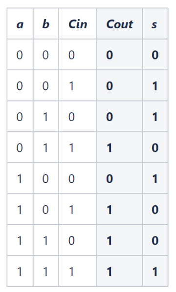{: style="float: left; width: 45%;" }
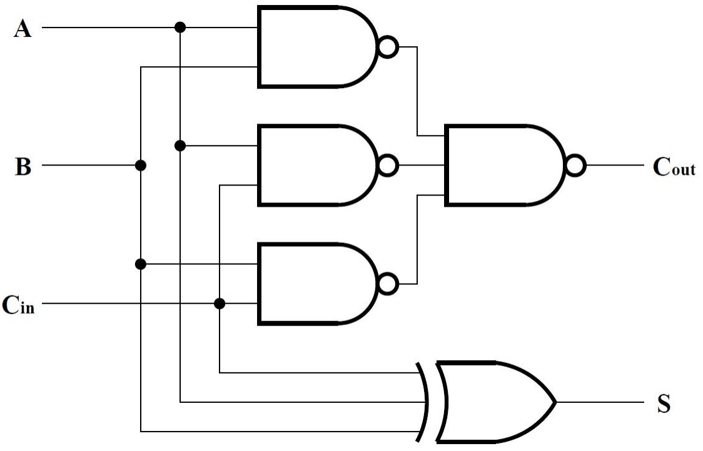{: style="float: right; width: 45%;" }
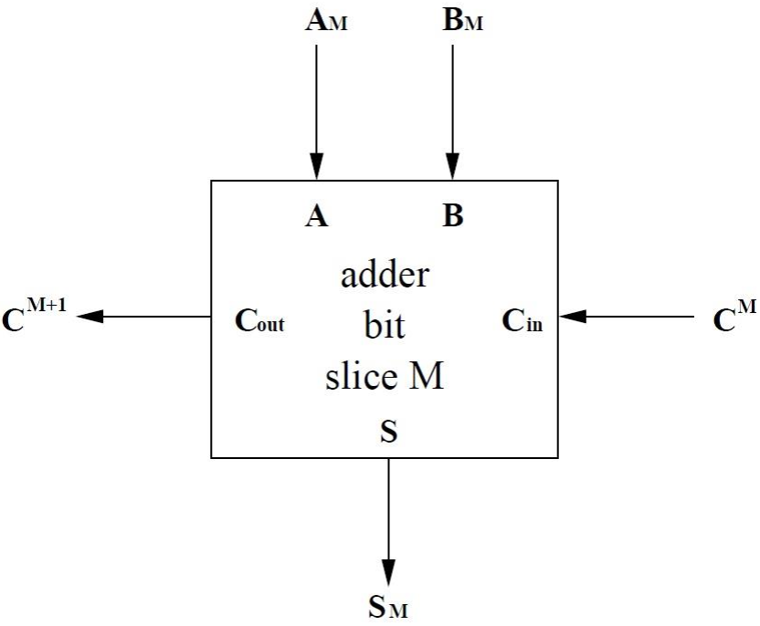{: style="float: right; width: 45%;" }

而Ripple Carry Adder就是由这些基本的Full Adder上组合起来的，用来实现多位加法的。我们把一个Full Adder抽象为一个Box，输入为Cin A B，输出为Cout和S，其中S作为本位计算的结果，是会作为最终加法运算的结果输出的，而Cout作为进位，是中间计算的产物，Cout作为下一个位的Cin，然后多个Full Adder就通过Cout传递向Cin串联在一起，组成一个Ripper Carry Adder(名字大概是由于Carry这一位就像水波一样一层层外推，一层层传递？)其背后的是递归的思想（给定n完成n+1），递归需要一个初始条件，Ripper Carry Adder的第一个加法器输入的Cin为0，A B从要被计算的数中来，最后输出$S_{n}S_{n-1}..S_{1}$作为运算的结果，最后一位Cout可以用来判断unsigned的加法计算有没有overflow

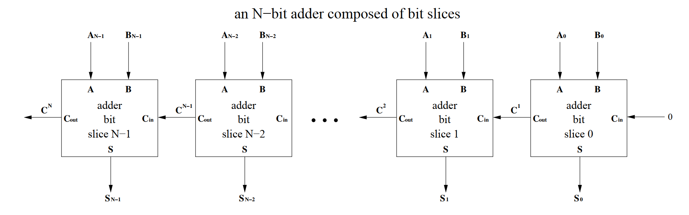
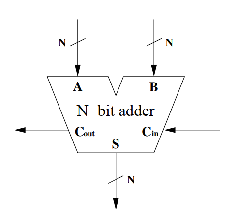{: style="float: left; width: 45%;" }

这些电路元器件的符号是逐层抽象的结果，先把CMOS抽象成逻辑门（AND门，NAND门，XOR门...）再把Full Adder里面的逻辑门实现的电路抽象成一个box，只显示输入和输出来表示Full Adder，再把N个Full Adder合成N位的Ripple Carry Adder，最后把Ripple Carry Adder抽象成一个box，不显示里面的Full Adder，只展示输入输出，N位的Ripple Carry Adder又可以进一步的串联，合成一个2N/3N/...位的更大的加法器

## Comparator

compartor的搭建在PPT中是一个非常完整的逻辑过程：选择bit slice中间传递信息的bit位数 -> 到赋予传递信息的bit相应的含义 -> 列出真值表 -> 化简相应逻辑 -> 设计门电路 -> 电路优化分析

### 1选择传递位数

不同于人类从高位比较到低位的方法，计算机从低位比较到高位，因为运算的过程无法在中途停下，所以人类的方法在计算机中并不能化简运算，如果从高位比较到低位（如人类），在bit slice中间不需要传递任何信息，因为高位的优先级大于低位，但是从低位比较大到高位就需要传递信息，有三种不同情况，大于，小于，等于，因此用两个bits

### 2赋予传递信息的bit含义

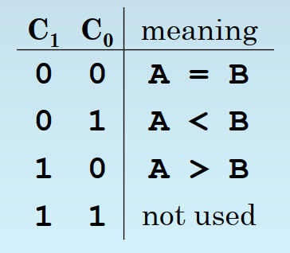

具体怎么设计完全是人为规定的，但是**不同的表示方法最后电路的复杂程度不同**

### 3列出真值表

原则是本位优先，如当前位A B，若A > B则运算结果不需要看传递的$C_0$ $C_1$就可以确定一定是A > B，若A = B，则由$C_0$ $C_1$的大小来确定最后运算的结果

    

        <table style="border-collapse: collapse; width: 500px;">
            <thead>
                <tr>
                    <th style="border: 1px solid black;">A</th>
                    <th style="border: 1px solid black;">B</th>
                    <th style="border: 1px solid black;">C0</th>
                    <th style="border: 1px solid black;">C1</th>
                    <th style="border: 1px solid black;">Z0</th>
                    <th style="border: 1px solid black;">Z1</th>
                </tr>
            </thead>
            <tbody>
                <tr>
                    <td style="border: 1px solid black;">0</td>
                    <td style="border: 1px solid black;">0</td>
                    <td style="border: 1px solid black;">0</td>
                    <td style="border: 1px solid black;">0</td>
                    <td style="border: 1px solid black;">0</td>
                    <td style="border: 1px solid black;">0</td>
                </tr>
                <tr>
                    <td style="border: 1px solid black;">0</td>
                    <td style="border: 1px solid black;">0</td>
                    <td style="border: 1px solid black;">0</td>
                    <td style="border: 1px solid black;">1</td>
                    <td style="border: 1px solid black;">0</td>
                    <td style="border: 1px solid black;">1</td>
                </tr>
                <tr>
                    <td style="border: 1px solid black;">0</td>
                    <td style="border: 1px solid black;">0</td>
                    <td style="border: 1px solid black;">1</td>
                    <td style="border: 1px solid black;">0</td>
                    <td style="border: 1px solid black;">1</td>
                    <td style="border: 1px solid black;">0</td>
                </tr>
                <tr>
                    <td style="border: 1px solid black;">0</td>
                    <td style="border: 1px solid black;">0</td>
                    <td style="border: 1px solid black;">1</td>
                    <td style="border: 1px solid black;">1</td>
                    <td style="border: 1px solid black;">X</td>
                    <td style="border: 1px solid black;">X</td>
                </tr>
                <tr>
                    <td style="border: 1px solid black;">0</td>
                    <td style="border: 1px solid black;">1</td>
                    <td style="border: 1px solid black;">0</td>
                    <td style="border: 1px solid black;">0</td>
                    <td style="border: 1px solid black;">0</td>
                    <td style="border: 1px solid black;">1</td>
                </tr>
                <tr>
                    <td style="border: 1px solid black;">0</td>
                    <td style="border: 1px solid black;">1</td>
                    <td style="border: 1px solid black;">0</td>
                    <td style="border: 1px solid black;">1</td>
                    <td style="border: 1px solid black;">0</td>
                    <td style="border: 1px solid black;">1</td>
                </tr>
                <tr>
                    <td style="border: 1px solid black;">0</td>
                    <td style="border: 1px solid black;">1</td>
                    <td style="border: 1px solid black;">1</td>
                    <td style="border: 1px solid black;">0</td>
                    <td style="border: 1px solid black;">0</td>
                    <td style="border: 1px solid black;">1</td>
                </tr>
                <tr>
                    <td style="border: 1px solid black;">0</td>
                    <td style="border: 1px solid black;">1</td>
                    <td style="border: 1px solid black;">1</td>
                    <td style="border: 1px solid black;">1</td>
                    <td style="border: 1px solid black;">X</td>
                    <td style="border: 1px solid black;">X</td>
                </tr>
                <tr>
                    <td style="border: 1px solid black;">1</td>
                    <td style="border: 1px solid black;">0</td>
                    <td style="border: 1px solid black;">0</td>
                    <td style="border: 1px solid black;">0</td>
                    <td style="border: 1px solid black;">1</td>
                    <td style="border: 1px solid black;">0</td>
                </tr>
                <tr>
                    <td style="border: 1px solid black;">1</td>
                    <td style="border: 1px solid black;">0</td>
                    <td style="border: 1px solid black;">0</td>
                    <td style="border: 1px solid black;">1</td>
                    <td style="border: 1px solid black;">1</td>
                    <td style="border: 1px solid black;">0</td>
                </tr>
                <tr>
                    <td style="border: 1px solid black;">1</td>
                    <td style="border: 1px solid black;">0</td>
                    <td style="border: 1px solid black;">1</td>
                    <td style="border: 1px solid black;">0</td>
                    <td style="border: 1px solid black;">1</td>
                    <td style="border: 1px solid black;">0</td>
                </tr>
                <tr>
                    <td style="border: 1px solid black;">1</td>
                    <td style="border: 1px solid black;">0</td>
                    <td style="border: 1px solid black;">1</td>
                    <td style="border: 1px solid black;">1</td>
                    <td style="border: 1px solid black;">X</td>
                    <td style="border: 1px solid black;">X</td>
                </tr>
                <tr>
                    <td style="border: 1px solid black;">1</td>
                    <td style="border: 1px solid black;">1</td>
                    <td style="border: 1px solid black;">0</td>
                    <td style="border: 1px solid black;">0</td>
                    <td style="border: 1px solid black;">0</td>
                    <td style="border: 1px solid black;">0</td>
                </tr>
                <tr>
                    <td style="border: 1px solid black;">1</td>
                    <td style="border: 1px solid black;">1</td>
                    <td style="border: 1px solid black;">0</td>
                    <td style="border: 1px solid black;">1</td>
                    <td style="border: 1px solid black;">0</td>
                    <td style="border: 1px solid black;">1</td>
                </tr>
                <tr>
                    <td style="border: 1px solid black;">1</td>
                    <td style="border: 1px solid black;">1</td>
                    <td style="border: 1px solid black;">1</td>
                    <td style="border: 1px solid black;">0</td>
                    <td style="border: 1px solid black;">1</td>
                    <td style="border: 1px solid black;">0</td>
                </tr>
                <tr>
                    <td style="border: 1px solid black;">1</td>
                    <td style="border: 1px solid black;">1</td>
                    <td style="border: 1px solid black;">1</td>
                    <td style="border: 1px solid black;">1</td>
                    <td style="border: 1px solid black;">X</td>
                    <td style="border: 1px solid black;">X</td>
                </tr>
            </tbody>
        </table>
    

### 4化简相应逻辑

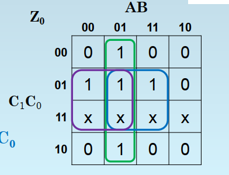{: style="float: left; width: 45%;" }
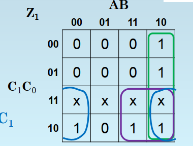{: style="float: right; width: 45%;" }

$$Z_1 = AB' + AC_1 + B'C_1$$

$$Z_0 = A'B +A'C_0 + BC_0$$

### 5设计门电路

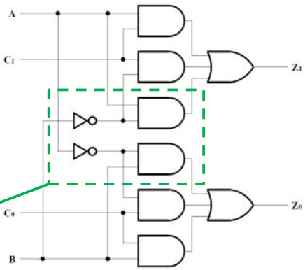{: style="float: left; width: 45%;" }
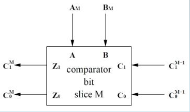{: style="float: right; width: 45%;" }

把每个comparator的输出$Z_0$ $Z_1$作为下一个compartor的$C_0$ $C_1$输入，最后一个comparator的输出$Z_0$ $Z_1$显示比较大小的最终结果。初始条件$C_0C_1 = 00$，表示两个数相等（初始还没有任何关于输入的信息，不能有任何bias）。comparator也像Ripple Carry Adder一样，最后抽象成一个box，只显示输入，输出，而隐藏内部电路

### 6分析优化电路

分析电路还是采用启发式方法（参见[Heuristics Methods](./Chapter4.md#heuristics-methods)），由于采用的电路设计是2-level logic，所以gate delay全部是2（不计算NOT门），bit slice的运算中时间累积的部分是$C_0$ 和 $C_1$，因为$C_0$ 和 $C_1$来自于上一个comparator的$Z_0$ $Z_1$，而$Z_0$ $Z_1$又和三个输入都有关，所以需要的时间是输入到输出的最长时间，最终所需的时间是2N gate delay

如果想要在时间上优化电路，需要减少$C_0$ $C_1$到$Z_0$ $Z_1$的门的数量。对于A B到$Z_0$ $Z_1$的门的数量无所谓，因为A B总是能在固定的时间内获得，时间是沿着$C_0$ $C_1$到$Z_0$ $Z_1$累加的，当comparator的比较的位数N很大时，A B到$Z_0$ $Z_1$造成的常数项delay，在$C_0$ $C_1$到$Z_0$ $Z_1$造成的与N成正比的delay可以忽略不计。在本例子中，从2 level 变成 1 level）并不是很可行，所以设法在空间上优化一下电路

$$Z_1 = AB' + AC_1 + B'C_1 = AB' + (A + B')C_1 = ((AB')'((A'B)'C_1)')'$$

$$Z_0 = A'B +A'C_0 + BC_0 = A'B + (A' + B)C_0 = ((A'B)'((AB')'C_0)')$$

这样化简的理由是1.合并同类项可以减少literal，如AB + BC = B（A + C）由四个literal减少到3个 2.电路都用NAND/NOR，所以最终转化成全部用NAND表示的形式，优化后的电路如下

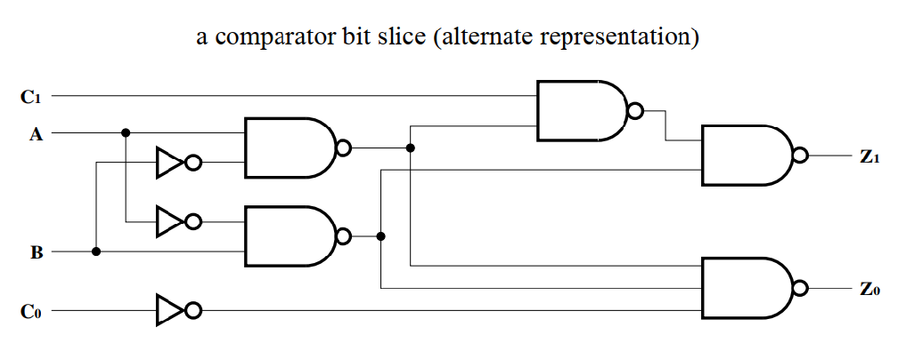

此时A B到输出$C_0$ $C_1$的gate delay 变成3，所以最后的gate delay变成2N + 1（第一次为3，此后每个comparator为2 所以是 3 + 2 + 2 + ... 总共有N-1个2）

### 拓展到2's Complement

对于2's complement的数进行比较，第一位sign bit是需要被特别考虑的，当正数与正数比较的时候，同unsigned 比较，当正数与负数比较的时候，正数一定大于负数，当负数与负数比较的时候？ 

因为2's complement中 -k是用$2^N - k$的bit pattern表示的（参见[2's Complement](./Chapter1.md#2s-complement)）当 $-K_1 < -K_2$时，不等式两边同时加上$2^N$，得到$2^N - K_1 < 2^N - K_2$，所以负数的比较可以和unsigned的正数一样操作

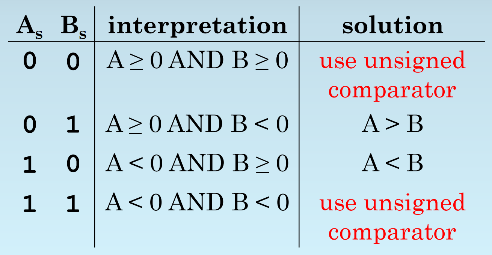{: style="float: left; width: 500px" }
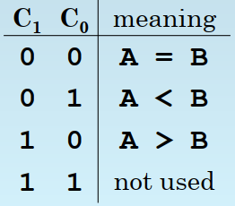{: style="float: right; width: 300px" }

对比$C_0$ $C_1$的设计含义，当sign bit为00 11时，因为遵守unsigned的comparator运算规则，并不需要特别处理，但是当$A_sB_s$ = 01 10的时候，正确的输出$Z_1 Z_0$应该是10 01，但是unsigned comparator的输出（对于unsigned来说1一定是大于0的）$Z_1 Z_0$的输出是01 10 此处不符合。一个巧妙的想法是吧unsigned bit的输入对换顺序，这样不影响$A_sB_s$ = 00 11的时候，因为此时两者相同，完全等价，而对于$A_sB_s$ = 01 10时，输出刚好对了

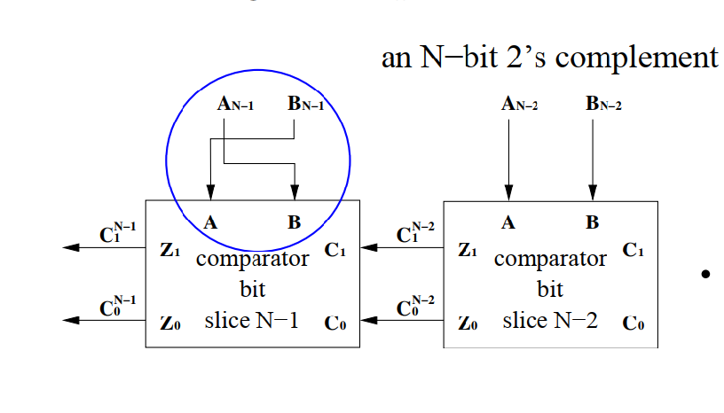

巧妙的思想：如果要加一个信号控制到底是unsigned的运算还是signed的运算，应该怎么做？假设增加的信号为F，当F为1的时候表示signed，为0表示unsigned，把F XOR Signed bit即可，XOR0是不会改变原来的bit的，XOR1会翻转原来的bit，当$A_sB_s$ = 00 11时，XOR 1 为 11 00 不影响，因为这两种情况等价，当$A_sB_s$ = 01 10时，XOR 1 为 10 01，刚好相当于把输入$A_s$和
$B_s$对掉

